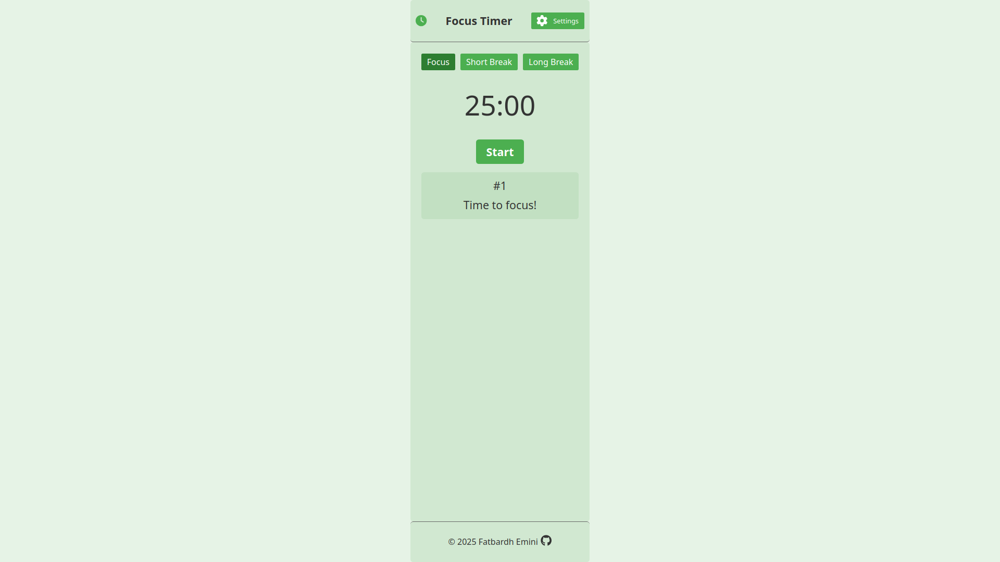
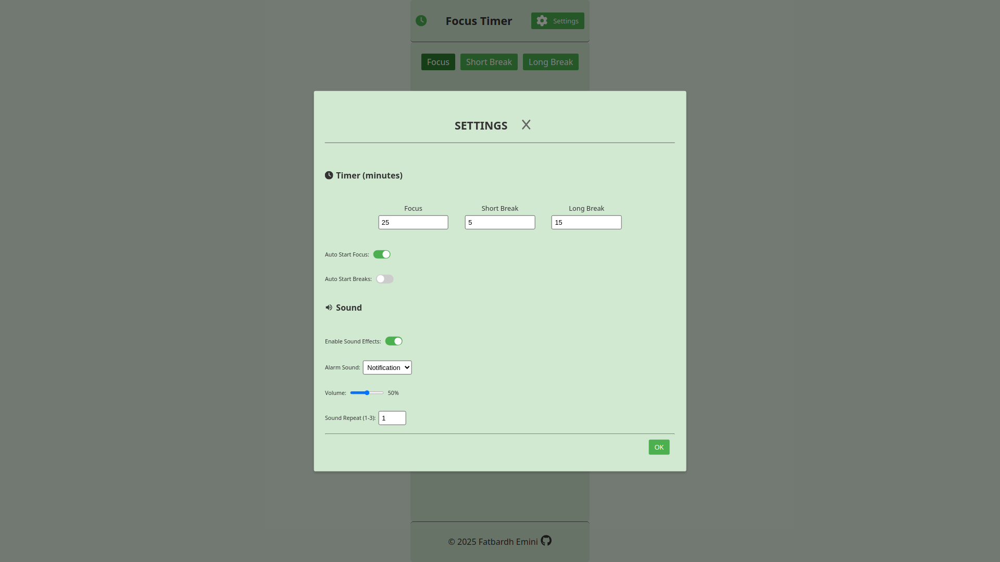

# Focus Timer

A modern, accessible Pomodoro timer built with React and Vite to enhance productivity through structured focus and break intervals. Features customizable session durations, sound notifications, auto-start options, and a responsive design with full accessibility support.

## Live Demo

Explore the application: [Focus Timer Live Demo](https://fatbardheminii.github.io/focus-timer)

## Screenshots




## Features

- **Pomodoro Technique**: Switch between focus, short break, and long break modes.
- **Customizable Settings**: Adjust session durations, enable/disable sound effects, select alarm sounds, and set volume and repeat counts.
- **Auto-Start Options**: Automatically start focus or break sessions.
- **Accessibility**: ARIA attributes, focus trapping, and screen reader support for inclusive usage.
- **Responsive Design**: Optimized for desktop and mobile devices.
- **Unit Tests**: Comprehensive tests using Vitest and React Testing Library with coverage reporting.

## Tech Stack

- **Frontend**: React 19, Vite
- **State Management**: React Context with Reducer
- **Styling**: CSS with custom properties
- **Sound**: `use-sound` for audio notifications
- **Testing**: Vitest, React Testing Library, Jest-DOM
- **Deployment**: GitHub Pages

## Installation

1. Clone the repository:
   ```bash
   git clone https://github.com/fatbardheminii/focus-timer.git
   ```
2. Navigate to the project directory:
   ```bash
   cd focus-timer
   ```
3. Install dependencies:
   ```bash
   npm install
   ```
4. Start the development server:
   ```bash
   npm run dev
   ```

## Usage

- **Start/Pause Timer**: Click the "Start" or "Pause" button to control the timer.
- **Switch Modes**: Use the "Focus," "Short Break," or "Long Break" buttons to change modes.
- **Customize Settings**: Click the gear icon to open the settings modal and adjust durations, auto-start options, or sound preferences.
- **Skip/Reset**: Skip to the next session or reset the timer when active.

## Testing

Run unit tests:
```bash
npm run test
```

Generate test coverage report:
```bash
npm run test:coverage
```

## Deployment

Build and deploy to GitHub Pages:
```bash
npm run deploy
```

## Contributing

Contributions are welcome! Please open an issue or submit a pull request for bug fixes or new features.

## License

MIT License